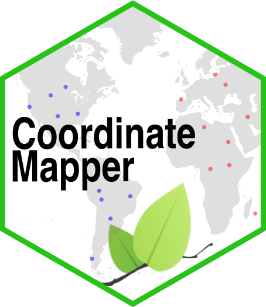

# Coordinate Mapper


## Rhett M. Rautsaw

This repository contains the underlying code for the **Coordinate Mapper** Shiny application hosted at 
[RhettRautsaw.github.io/shiny/CoordinateMapper](https://RhettRautsaw.github.io/shiny/CoordinateMapper/)

This app is designed to quickly map and visualize decimal degree data points and color them by a given category. The app takes a single 4 column tab-delimited copy-paste input. 

| Column 1 | Column 2 | Column 3 | Column 4  |
|----------|----------|----------|-----------|
|    ID    | Category | Latitude | Longitude |

<br>

## TO DO LIST (Additions)
- Ability to change color of points
- Click add points & export coordinates

## Running the Application Locally

This app can also be run through R:

```R
library(shiny)

# Easiest way is to use runGitHub
runGitHub("CoordinateMapper", "RhettRautsaw")

# Run a tar or zip file directly
runUrl("https://github.com/RhettRautsaw/CoordinateMapper/archive/master.tar.gz")
runUrl("https://github.com/RhettRautsaw/CoordinateMapper/archive/master.zip")
```

To run a Shiny app from a subdirectory in the repo or zip file, you can use the `subdir` argument. This repository happens to contain another copy of the app in `inst/shinyapp/`.

```R
runGitHub("CoordinateMapper", "RhettRautsaw", subdir = "inst/shinyapp/")

runUrl("https://github.com/RhettRautsaw/CoordinateMapper/archive/master.tar.gz",
  subdir = "inst/shinyapp/")
```
