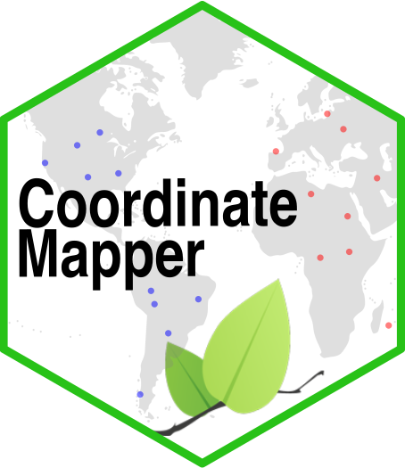

# Coordinate Mapper


## Rhett M. Rautsaw

This repository contains the source code for the **Coordinate Mapper** web application hosted at
[rhettrautsaw.github.io/CoordinateMapper](https://rhettrautsaw.github.io/CoordinateMapper).

Coordinate Mapper is designed to quickly map and visualize decimal degree coordinates and color points by category. The new app is built directly with HTML/CSS/JavaScript and Leaflet for a faster, lighter-weight experience than the legacy Shiny version.

## User Guide

### Option 1: Paste data directly into the table

Paste a four-column block directly from Excel, Google Sheets, or any tabular text source into the editable table.

| Column 1 | Column 2 | Column 3 | Column 4  |
|----------|----------|----------|-----------|
|    ID    | Category | Latitude | Longitude |

Headers are optional for pasted data.

### Option 2: Import a CSV or TSV file

For larger datasets, import a `.csv`, `.tsv`, or `.txt` file and then choose which columns correspond to:

- ID
- Category
- Latitude
- Longitude

The app will try to auto-detect latitude and longitude columns, but users can adjust the dropdowns before mapping.

### Features

- Terrain basemap by default, with additional basemap and overlay options
- Category-colored points with popup details and a legend
- Collapsible control panel
- Mobile-friendly layout with a bottom-sheet control panel

<br>

# Updates/Changelog
- **2026-03-22**: 
	- Shiny app was updated to support the latest version of R and package dependencies including switching to use `sf` and `terra` instead of `sp` and `raster`. 
	- Shiny app is being deprecated in favor of a new web app built directly with HTML/CSS/JS. This results in significant speed and performance improvements. 
		- The new web app is found in this repository [rhettrautsaw.github.io/CoordinateMapper](https://rhettrautsaw.github.io/CoordinateMapper).
		- **PLEASE BOOKMARK THE NEW PAGE BY JULY 2026**

# Shiny App (Deprecated)

## Running the Application Locally

This app can also be run through R:

```R
library(shiny)

# Easiest way is to use runGitHub
runGitHub("CoordinateMapper", "RhettRautsaw")

# Run a tar or zip file directly
runUrl("https://github.com/RhettRautsaw/CoordinateMapper/archive/master.tar.gz")
runUrl("https://github.com/RhettRautsaw/CoordinateMapper/archive/master.zip")
```

To run a Shiny app from a subdirectory in the repo or zip file, you can use the `subdir` argument. This repository happens to contain another copy of the app in `inst/shinyapp/`.

```R
runGitHub("CoordinateMapper", "RhettRautsaw", subdir = "inst/shinyapp/")

runUrl("https://github.com/RhettRautsaw/CoordinateMapper/archive/master.tar.gz",
  subdir = "inst/shinyapp/")
```

# TO DO LIST (Additions)
- Ability to change color of points
- Click add points & export coordinates
